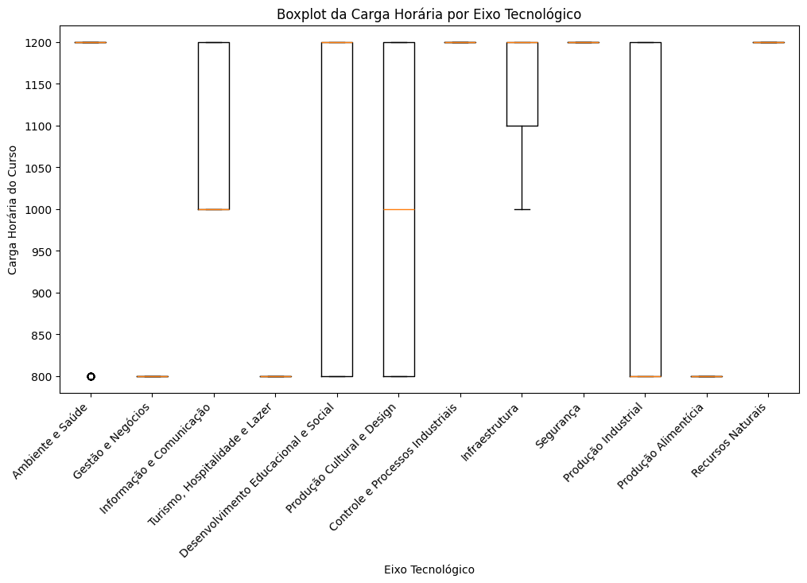
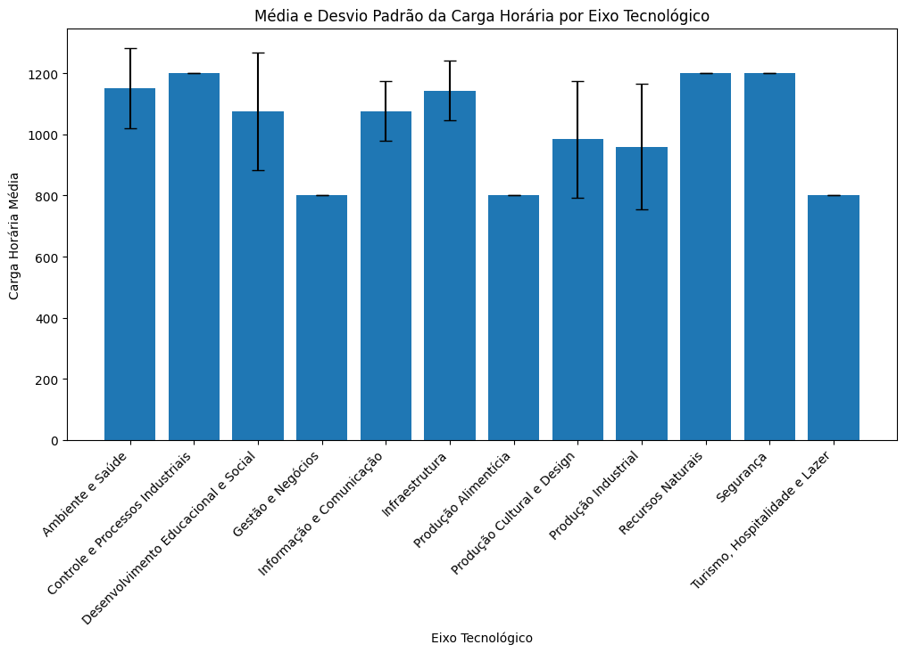
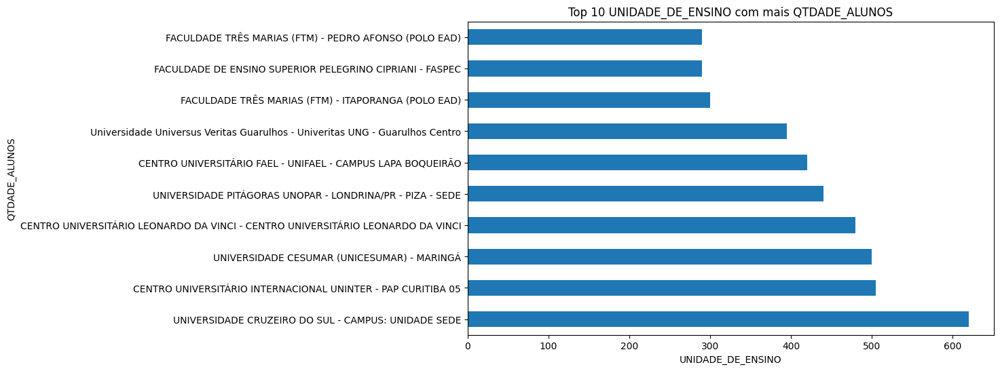
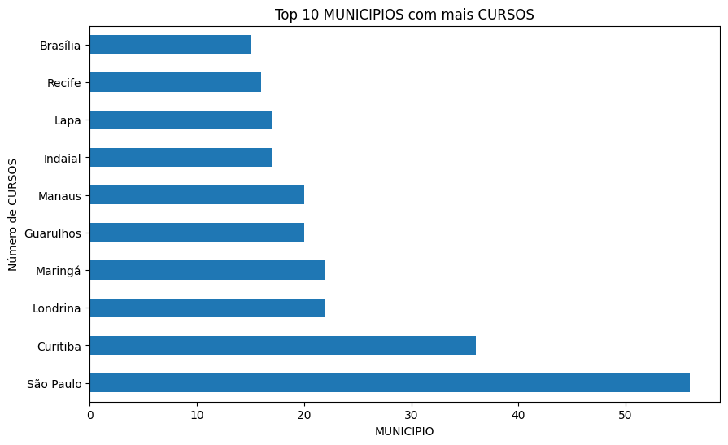
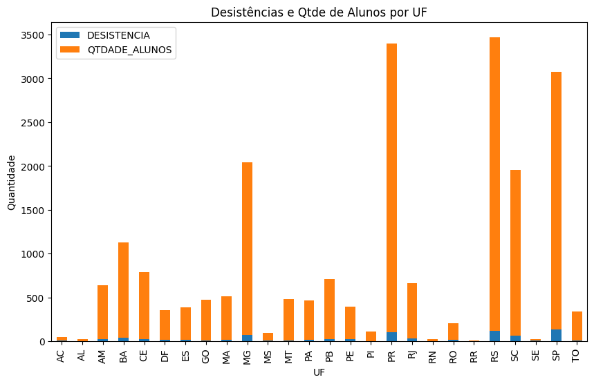
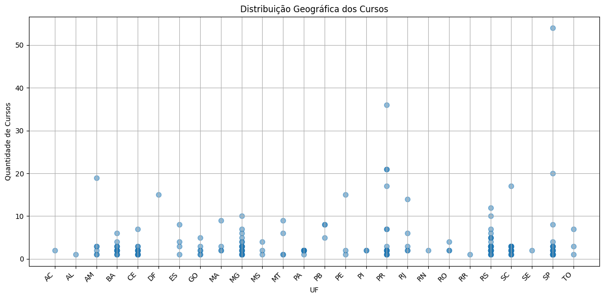

# Módulo: Técnicas de programação I (PY) #
Oferecido por: 
 <i class="fas fa-laptop"></i> 📔 AdaTech e Ifood <i class="fas fa-laptop"></i> 📔

**Professores:**
<i class="fas fa-laptop"></i> 📔 Alex Lima & Camila Assis <i class="fas fa-laptop"></i> 📔

⭐⭐⭐⭐⭐⭐⭐⭐⭐⭐⭐⭐⭐⭐⭐⭐⭐⭐⭐⭐⭐⭐⭐⭐⭐⭐⭐⭐⭐⭐⭐⭐⭐⭐⭐⭐⭐

<h3>Projeto Vem Ser Tech 2024 - <DS> Turma 1101<h3>

**Objetivo e Orientações do Projeto**  Realizar uma análise exploratória de dados utilizando datasets relacionados ao Brasil. Estruture sua análise criando um storytelling: Uma história contada com informações, gráficos, imagens e medidas estatísticas, associando dados a fatos em uma linha do tempo. Você está livre para incluir quantas bases considerar necessário e filtrar as informações mais relevantes para sua história.  
  
  **Banco de Dados**
  
⚓ https://drive.google.com/file/d/1mGzkh_ZQEG4BiV96XFiLlOIxbL259xyJ/view?usp=sharing

Esse banco de Dados foi formulado com dados extraídos de uma base do MEC, porém foram criados dados fictícios pelo nosso grupo para ajudar a trabalhar melhor com análise de dimensões e colunas

⚓ Banco de dados original: https://olinda.mec.gov.br/olinda-ide/servico/PDA_SETEC/versao/v1/odata/Relatorio_IPES_Cursos?$format=text/csv&$top=100000

A base de dados vem da Secretaria de Educação Profissional e Tecnológica (Setec) é responsável por formular, planejar, coordenar, implementar, monitorar e avaliar políticas públicas de Educação Profissional e Tecnológica (EPT), desenvolvidas em regime de colaboração com os sistemas de ensino e os agentes sociais parceiros. A Setec/MEC ainda responde pela manutenção, supervisão e fortalecimento das instituições que compõem a Rede Federal de Educação Profissional, Científica e Tecnológica.
Como dito, foram inseridas métricas, pois o banco se compunha apenas de Dimensões, com isso, a análise em si serve apenas para aprendizado é fictícia.

⭐⭐⭐⭐⭐⭐⭐⭐⭐⭐⭐⭐⭐⭐⭐⭐⭐⭐⭐⭐⭐⭐⭐⭐⭐⭐⭐⭐⭐⭐⭐⭐⭐⭐⭐⭐⭐

Realizamos toda a tratativa dos dados, com vários trechos de códigos relevantes ao aprendizado e entendimento do comportamento dos dados fictícios na observação da evasão (desistência), UFs e Instituições com mais ofertas de cursos, maiores cargas horárias, outliers, desvio padrão por Eixo Técnólogico, enfim...Pudemos extrair insights siginificativos com o uso das bibliotecas Pandas e Matplotlib, foi um projeto muito divertido e sem dúvida alguma ajudou muito não só no aprendizado como em fixar conhecimento. 
Abaixo seguem alguns dos gráficos produzidos: 

⭐⭐⭐⭐⭐⭐⭐⭐⭐⭐⭐⭐⭐⭐⭐⭐⭐⭐⭐⭐⭐⭐⭐⭐⭐⭐⭐⭐⭐⭐⭐⭐⭐⭐⭐⭐⭐

**Participação**

⭐ O grupo é composto por 6 integrantes, podemos ver a participação conforme a quantidade de commits realizadas no Projeto, trabalhamos via Collab, Vscode e git

⭐⭐⭐⭐⭐⭐⭐⭐⭐⭐⭐⭐⭐⭐⭐⭐⭐⭐⭐⭐⭐⭐⭐⭐⭐⭐⭐⭐⭐⭐⭐⭐⭐⭐⭐⭐⭐

**Grupo E**  
Composto por: 

⭐Letícia dos Santos 
⭐Rafael Braga 
⭐Carlos Victor Santana 
⭐Milena Juliane 
⭐Michele Regina 
⭐Cristiane Rabelo 
